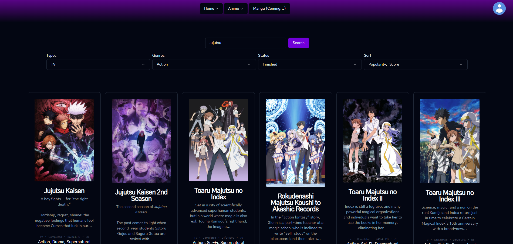
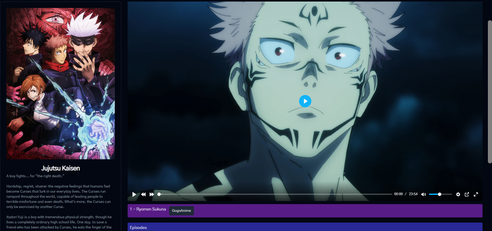

<h1 align="center">Ani-Master</h1>

  
   

  

> The hub for anime and all related content.

> [!WARNING]
> The project is still in the early stages of development. But if you are interested, then star the project and come back later.

## Table of Contents
* [General Info](#general-information)
* [Tech Tack](#tech-stack)
* [Features](#features)
* [Screenshots](#screenshots)
* [Setup](#setup)
* [Project Status](#project-status)
* [Acknowledgements](#acknowledgements)
* [Contact](#contact)
<!-- * [License](#license) -->

## ⚡General Information
This project was started because I was tired of having to use the public websites.
There are some that is fine, but you almost always have to deal with ads and popups.
Also, you needed a VPN for security and privacy.
So I started to look for a website I could self-host, but there was none good enough.
 
So I decided to make my own.

### 🥅The Goal
- [ ] A website that is easy to use.
- [ ] A website that is easy to self-host.
- [ ] A website that is easy to maintain.
- [ ] A website that is easy to update.
- [ ] A place where there is everything you need.

## 🧬Tech Stack
- [Next.Js](https://nextjs.org/) V.14 - Frontend
  - [Shadcn/UI](https://ui.shadcn.com/) - UI Library
- SQLite - Database
- [Lucia-Auth](https://lucia-auth.com/) V.2.7.6 - Auth
- [Consumet.org](https://github.com/consumet/api.consumet.org) V.1.5.5 - Content API

## 🔥Features
🟢List the ready features here:
- None yet

🟡Currently working on:
- Main page
- Anime page
- Search page

🔴Next features:
- Main structure
  - More...
- Auth
- Basic Anime Watching
- Cache

## 🎦Screenshots
Anime search page (Work in progress, not finished)

Anime page (Work in progress, not finished)

## 🔨Setup

### 💻Local Development
1. Clone the repo
2. Install dependencies `npm install`
3. Start the server `npm run dev`

## 🚦Project Status
Project is: **_in progress_**

## 📝Contribution
Contributions are always welcome!
Contributions can be given in the form of:
- Code (PR)
- Documentation (PR)
- Ideas (Issues)
- Bug reports (Issues)

## 🪙Acknowledgements
Give credit here.
- Maby coming...

## 📱Contact
You can contact me with this email `tobias@tohjuler.dk`

<!-- Optional -->
<!-- ## License -->
<!-- This project is open source and available under the [... License](). -->
